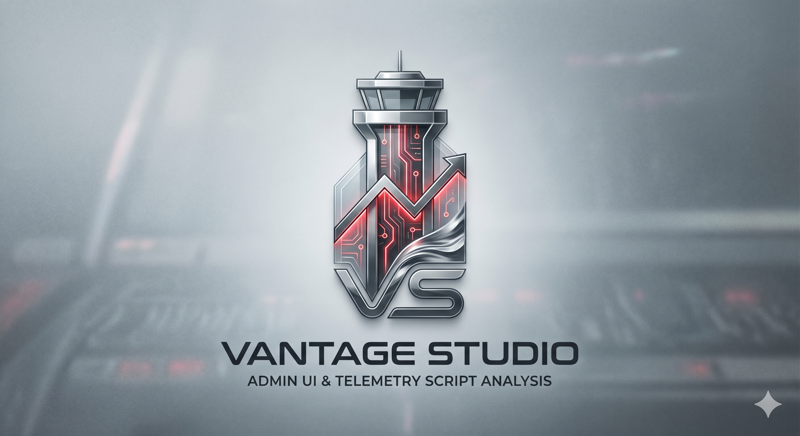

<p align="center">
  
</p>

# Vantage Studio

A web admin for Apache SkyWalking's runtime-rule hot-update system —
browse, edit, and push MAL / LAL rules without restarting the OAP
cluster.

[](https://github.com/wu-sheng/vantage-studio/actions/workflows/ci.yml)
[](LICENSE)

## What it is

Vantage Studio is an **extension** of Apache SkyWalking, not a fork.
It runs as a separate process (Docker image) and talks to the OAP
server's runtime-rule admin HTTP port (default `17128`) plus the
upstream status APIs on the query port (`12800`). It adds the things
SkyWalking's runtime-rule receiver intentionally doesn't ship:

- A login + RBAC layer in front of an admin port that has none today.
- A pixel-careful UI for browsing rule catalogs (`otel-rules`,
  `log-mal-rules`, `lal`), editing YAML with Monaco + bundled MAL/LAL
  DSL grammar autocomplete, and pushing via `addOrUpdate` /
  `inactivate` / `delete`.
- Cluster status across every OAP node, dump (`tar.gz`) of the live
  ruleset, and the destructive-confirm gate for `allowStorageChange`
  and `revertToBundled`.

## Quick start

```bash
git clone https://github.com/wu-sheng/vantage-studio
cd vantage-studio
make compose-up
```

Visit <http://localhost:8080>; login `admin` / `vantage-changeme`.

> Replace the default password by editing the `studio.yaml` that
> lives in the `studio-data` volume. See [`docs/install.md`](docs/install.md)
> for the OAP image pin you'll need until the upstream
> `feature/runtime-rule-hot-update` branch lands in a tagged release.

## Documentation

- [`docs/install.md`](docs/install.md) — Docker, compose, production
  install hints.
- [`docs/configure.md`](docs/configure.md) — every `studio.yaml` knob.
- [`docs/auth.md`](docs/auth.md) — users, optional RBAC, audit log.
- [`docs/operator-workflows.md`](docs/operator-workflows.md) — push
  a rule, recover from a broken push, inspect cluster, take a dump.
- [`docs/compatibility.md`](docs/compatibility.md) — OAP version pin
  and the deferred-features list.
- [`CHANGELOG.md`](CHANGELOG.md) — release notes.

## Repository layout

```
vantage-studio/
├── apps/
│   ├── ui/                 # Vue 3 + Vite SPA
│   └── bff/                # Fastify TypeScript BFF
├── packages/
│   ├── api-client/         # typed wrappers for the OAP runtime-rule REST surface
│   └── design-tokens/      # rrDark + RR_FONT_* + spacing scale
├── deploy/
│   └── docker/             # Dockerfile + docker-compose.yml + studio.yaml.example
├── docs/                   # operator documentation
├── scripts/                # license-header check
├── Makefile                # make compose-up / make image / make check
└── .github/workflows/      # ci.yml + release.yml
```

## Releases

Releases are cut by GitHub Actions, not by hand. Push a `vX.Y.Z` tag
(or run the `Release` workflow manually) and the
[release.yml](.github/workflows/release.yml) job builds the image,
publishes `ghcr.io/<repo>:<version>` + `:latest`, signs both with
cosign keyless, and attaches a CycloneDX SBOM attestation. Commit
images for `main` are published by [ci.yml](.github/workflows/ci.yml)
under `:sha-<short>` / `:main`.

## License

Apache License 2.0. See [LICENSE](LICENSE) and [NOTICE](NOTICE).

Apache, Apache SkyWalking, and SkyWalking are trademarks of The
Apache Software Foundation. Vantage Studio is an independent
extension and is not endorsed by the ASF.
